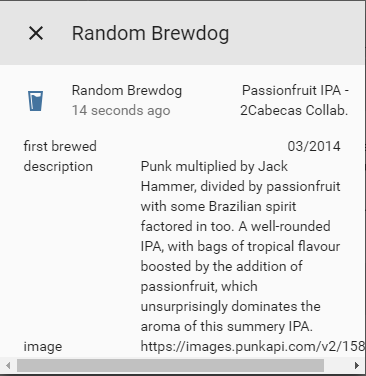

# custom_component to get info about a random beer

A platform which allows you to get information about a random BrewDog beer.
  
To get started put `/custom_components/sensor/brewdog.py` here:  
`<config directory>/custom_components/sensor/brewdog.py`  
  
**Example configuration.yaml:**

```yaml
sensor:
  platform: brewdog
```

**Configuration variables:**  
  
key | description  
:--- | :---  
**platform (Required)** | The platform name.  
  
## Sample overview


  
[Home-Assistant demo site.](https://ha-test-brewdog.halfdecent.io/)
  
***
Due to how `custom_componentes` are loaded, it is normal to see a `ModuleNotFoundError` error on first boot after adding this, to resolve it, restart Home-Assistant.