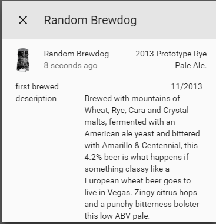

# custom_component to get info about a random beer.
    
A platform which allows you to get information about a random BrewDog beer.
  
To get started put `/custom_components/sensor/brewdog.py` here:
`<config directory>/custom_components/sensor/brewdog.py`  
  
**Example configuration.yaml:**
```yaml
sensor:
  platform: brewdog
```
**Configuration variables:**  
  
key | description  
:--- | :---  
**platform (Required)** | The platform name.  
  
#### Sample overview

  
[Home-Assistant demo site.](https://ha-test-brewdog.halfdecent.io/)
  
  
push_github:  stage: deploy
  script:
    - curl -sL https://gitlab.com/ludeeus/toolbox/raw/master/CI-Scripts/push_to_public_repo/init.sh | bash -s github pip-packages  /root
    - curl -sL https://gitlab.com/ludeeus/toolbox/raw/master/CI-Scripts/push_to_public_repo/push.sh | bash -s Europe/Oslo
